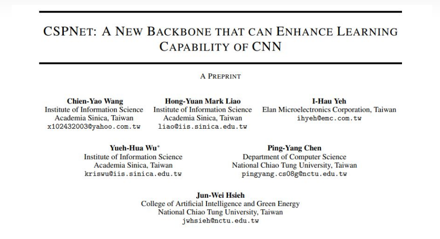
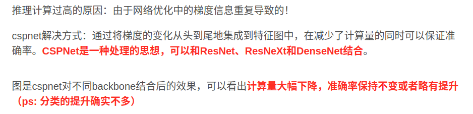
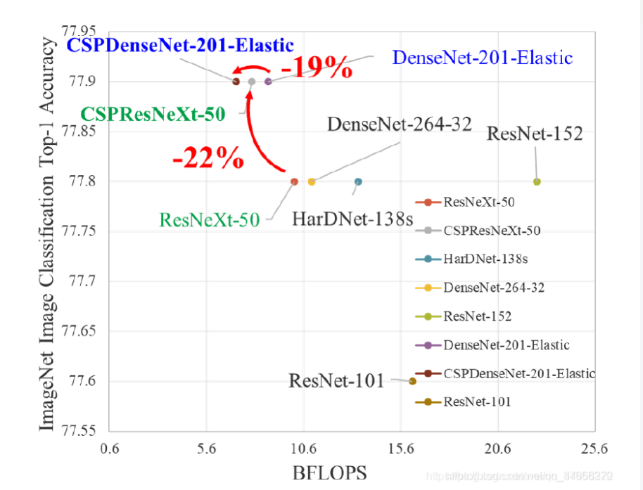
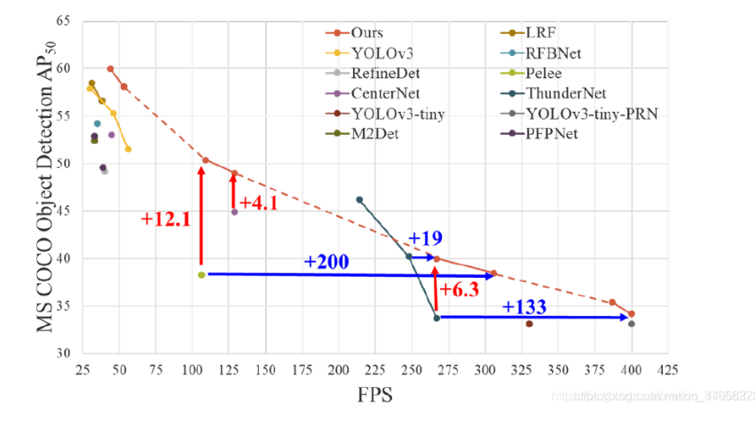
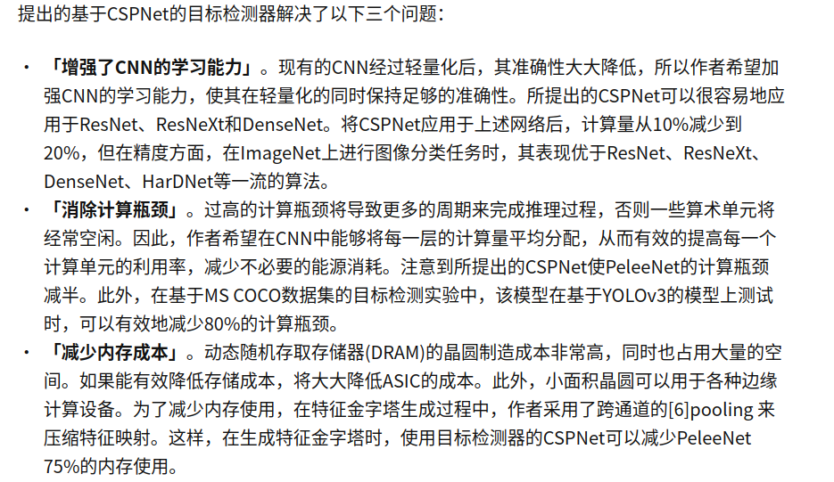
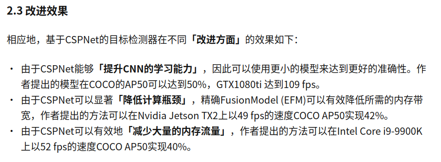

Cross Stage Partial Networks跨阶段局部网络

参考：[一种强学习能力的跨阶段局部网络](https://zhuanlan.zhihu.com/p/393778545)

## 介绍

作者提出了跨阶段局部网络(CSPNet)，用来缓解以往工作需要从网络架构角度进行大量推理计算的问题，作者把这个问题归结为网络优化中的**「重复梯度信息」**。

CSPNet通过整合网络阶段开始和结束的特征图来尊重梯度的可变性，在我们的实验中，该方法减少了20%的计算量，在ImageNet数据集上具有相当、甚至更高的精度，并且在MS COCO目标检测数据集上的AP50方面显著优于最先进的方法。

除此之外，CSPNet易于实现，并且足够通用，可以处理基于**「ResNet」**、**「ResNeXt」**和**「DenseNet」**的体系结构。

## 文章思路

随着卷积神经网络结构变得更深更宽，CNN显示出了它特别强大的功能。但是，扩展神经网络的体系结构<u>通常会带来更多的计算</u>，这使大多数人无法负担诸如目标检测之类的<u>计算量繁重的任务</u>。

**「轻量级计算」**已逐渐受到越来越多的关注，因为实际应用通常需要在<u>小型设备</u>上，所以需要缩短推理时间，这对计算机视觉算法提出了严峻挑战。尽管某些方法是专门为移动CPU设计的，但它们采用的**「深度可分离卷积」**技术与工业IC设计不兼容，例如用于特定用途的集成电路（ASIC）。

由此，而提出了**「跨阶段局部网络」**(CSPNet)。在这项工作中，作者研究了最先进的方法，比如ResNet、ResNeXt和DenseNet的计算负担。进一步将开发的高效组件与上述网络融合，使上述网络可以部署在cpu和移动gpu上，而<u>不会牺牲性能</u>。

## 解决问题

<u>设计CSPNet的主要目的是使该体系结构能够实现**「更丰富的梯度组合，同时减少计算量」**。通过将基础层的特征图划分为两个部分，然后通过提出的跨阶段层次结构将它们合并，可以实现此目标。</u>

**「作者的主要想法」**是通过分割梯度流，使梯度流通过不同的网络路径传播。通过切换串联和过渡步骤，传播的梯度信息可以具有较大的相关性差异。此外，CSPNet可以大大减少计算量，并提高推理速度和准确性，如图1所示。

## 改进方法