## 介绍

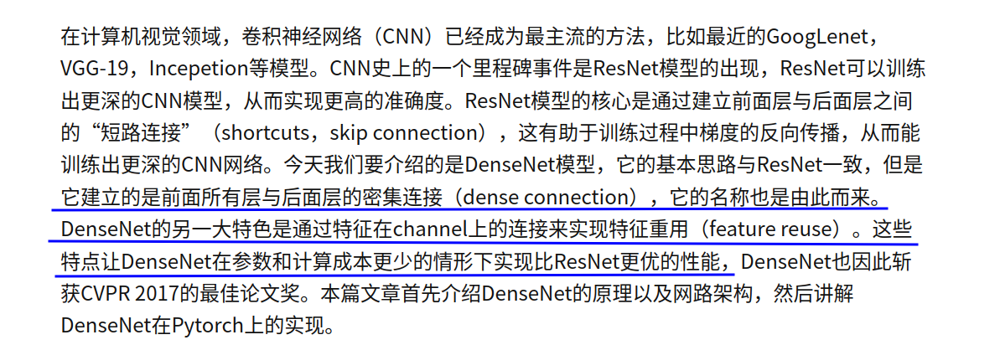

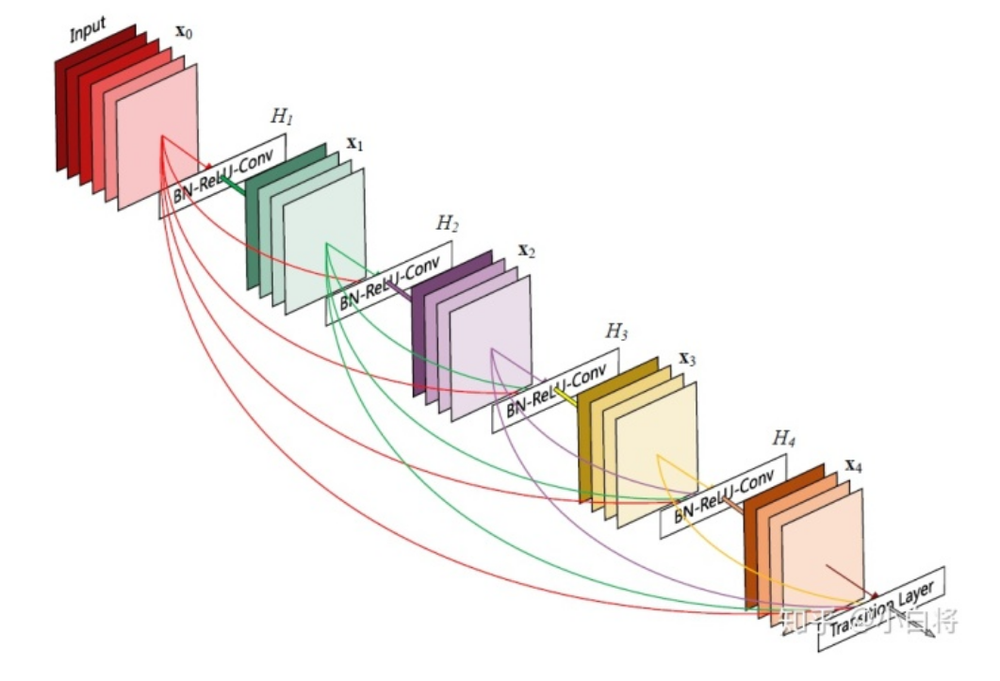

## 设计理念

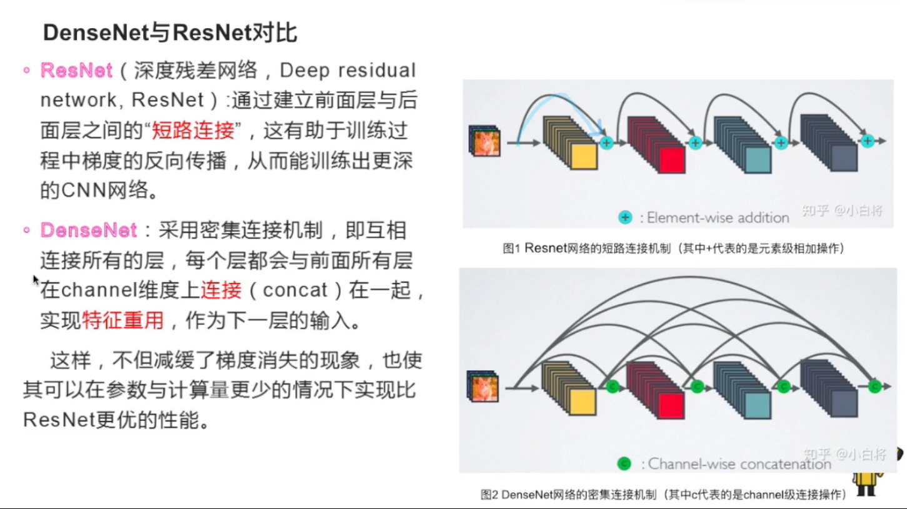

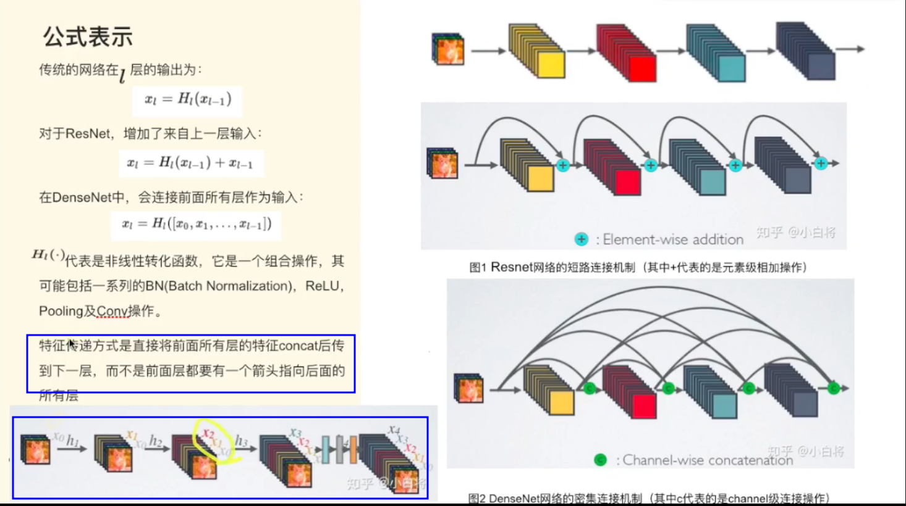

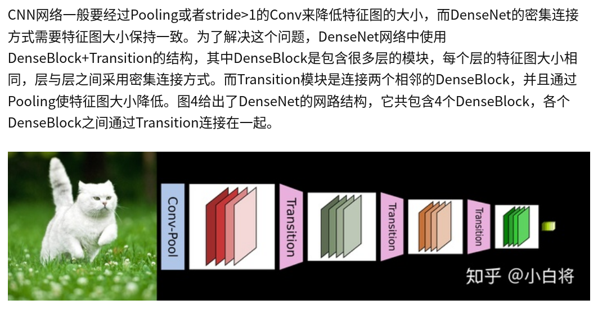

## 网络结构

### Dense Block

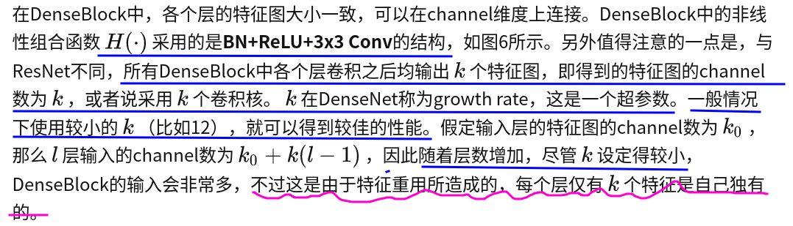

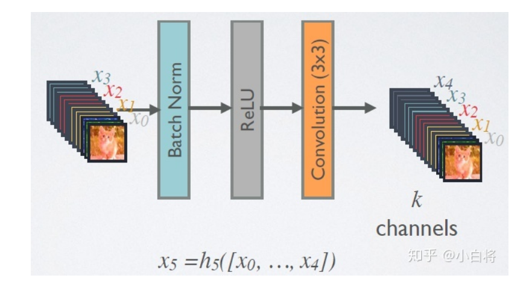

- 上图计算细节：在每个DenseBlock中，每个层的计算结果，也就是经过$H(.)$的结果的channel都是k，然后再加上之前cat n-1层的结果

#### DenseBlock+bottleneck -> DenseNet-B

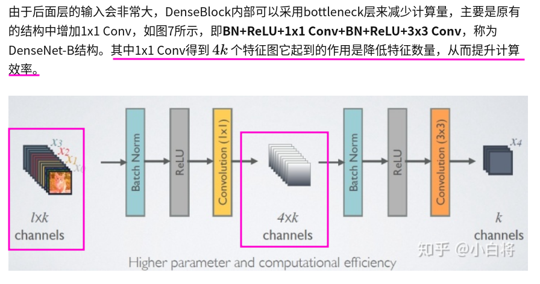

- 通常1*1卷积输出的通道数通常是GrowthRate(K)的4倍 

### Transition

#### Transition + compression rate -> DenseNet-C

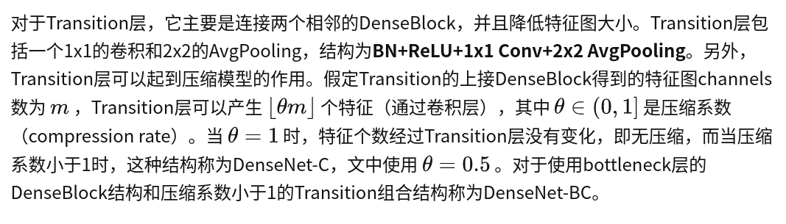

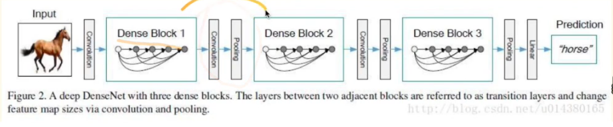

## 性能对比

### pre-activation

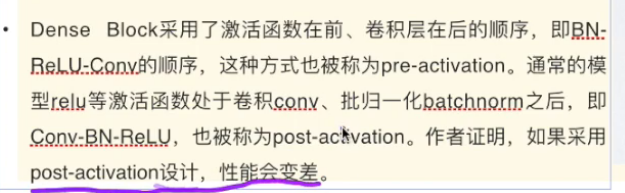

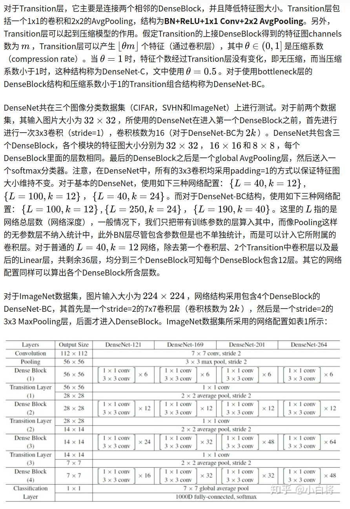

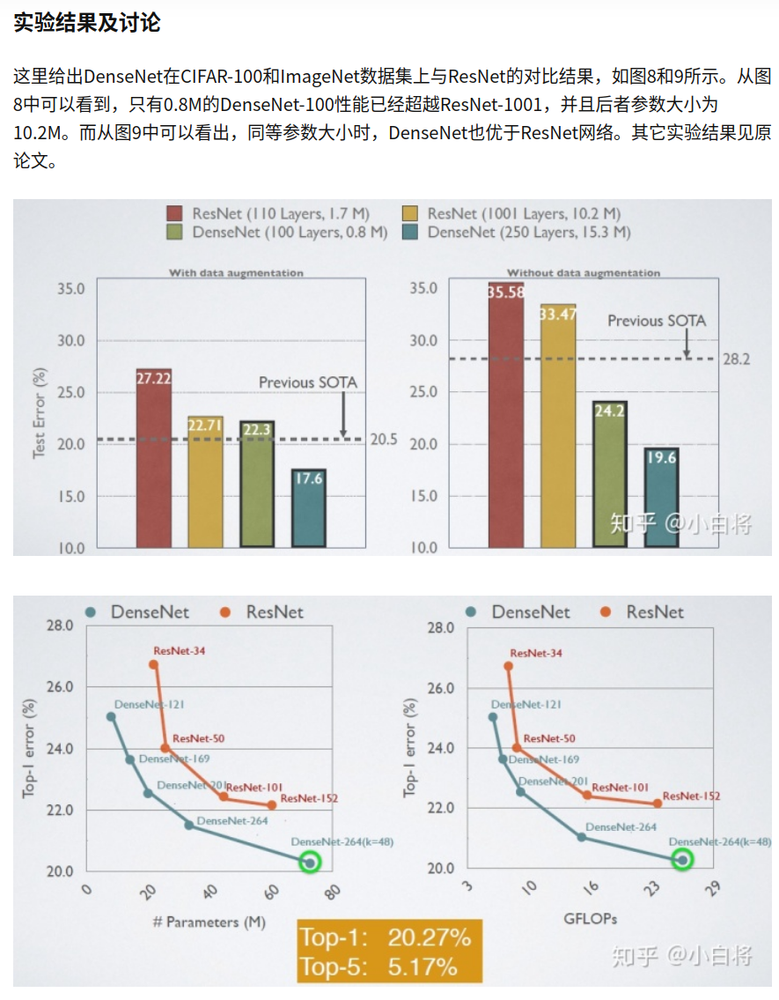

## DenseNet的优势

### 1.更强的梯度流动

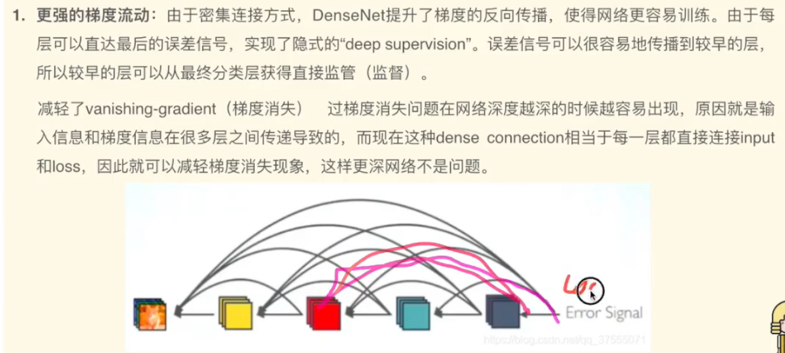

### 2.减少了参数量

DenseNet的DenseBlock中越往后的层虽然参数越多，但是大部分都可以直接来自前面，所以参数量更少

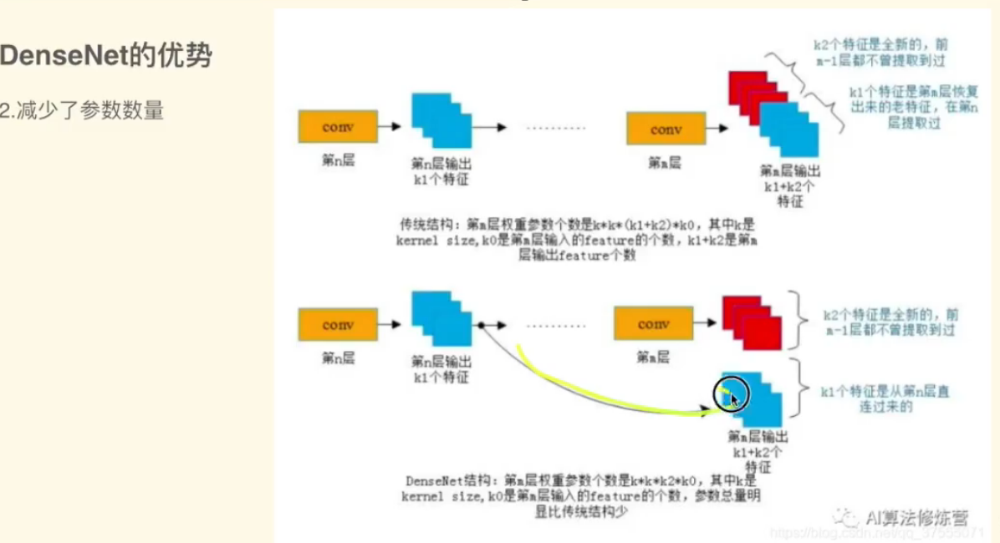

### 3.保存了低维度的特征

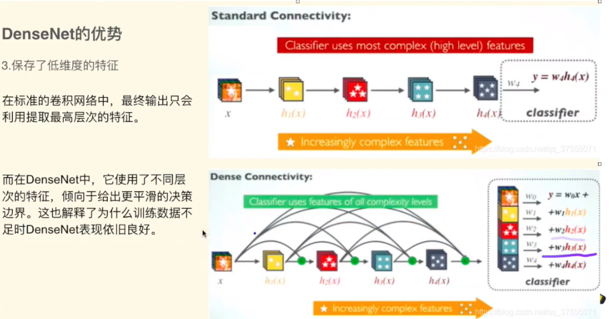

## DenseNet的不足

DenseNet由于需要进行多次Concatnate操作，数据需要被多次复制，显存容易增加的很快，需要一定的显存优化技术，另外DeseNet是一种更为特殊的网络，ResNet则相对一般化一些，所以ResNet的应用范围更广

一种高效的DenseNet的实现：论文如下：[Memory-Efficient Implementation of DenseNets](https://link.zhihu.com/?target=https%3A//arxiv.org/abs/1707.06990)

不过可以使用PyTorch框架自动实现这种优化

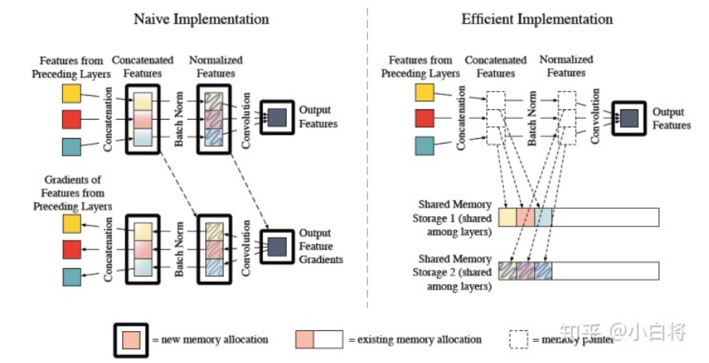

