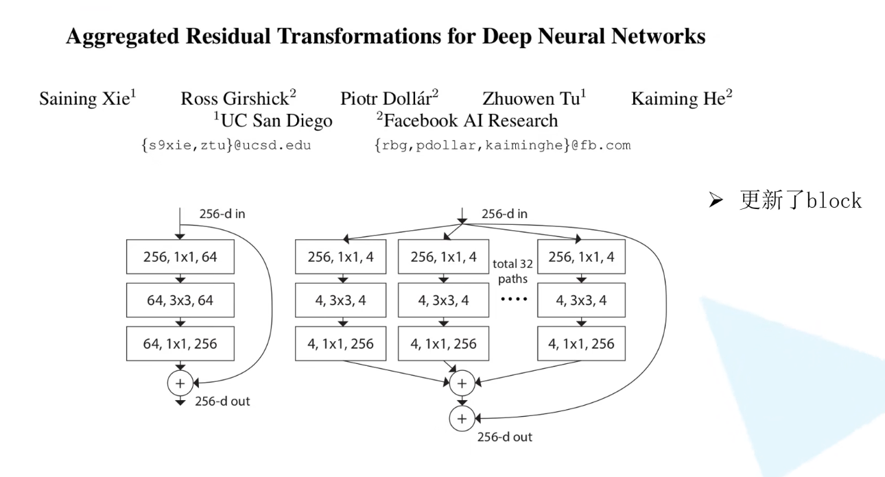

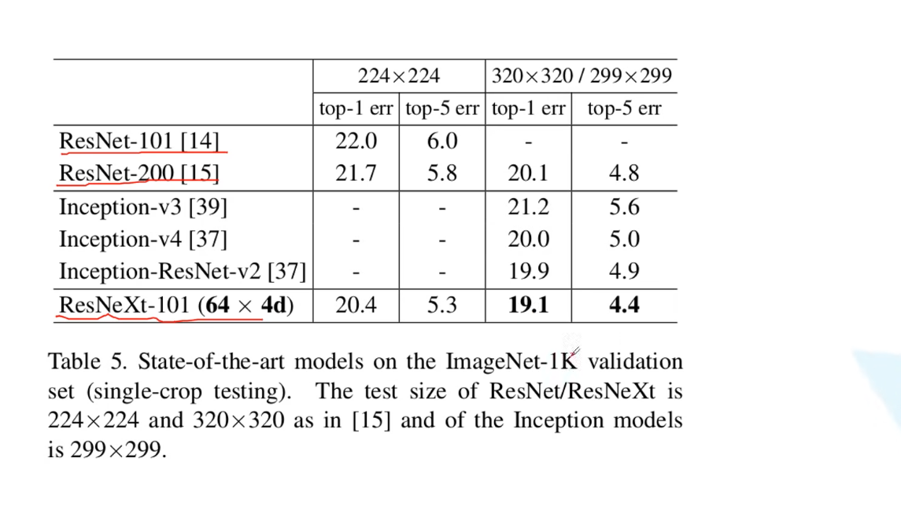

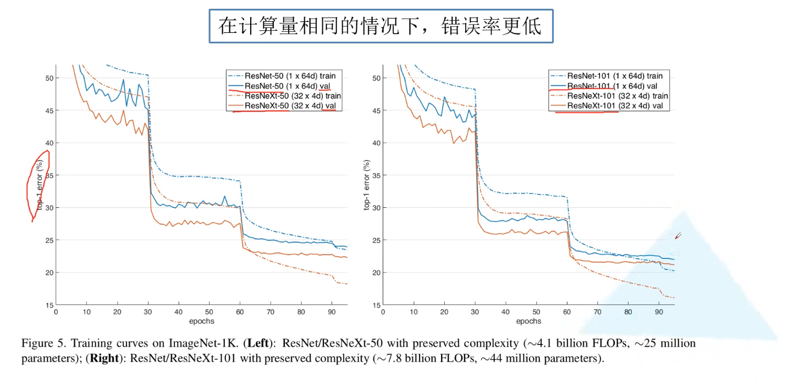  

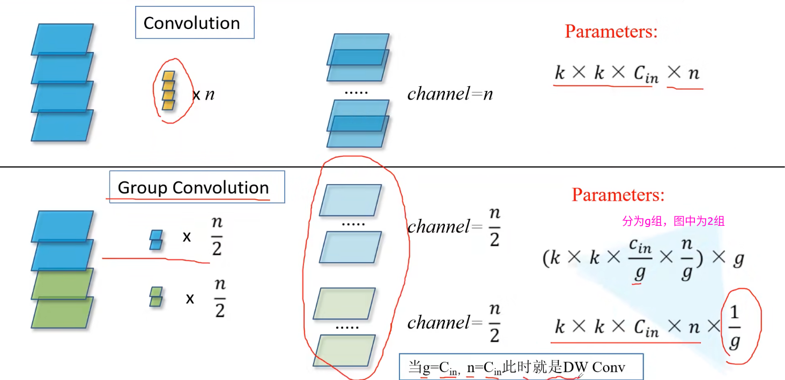

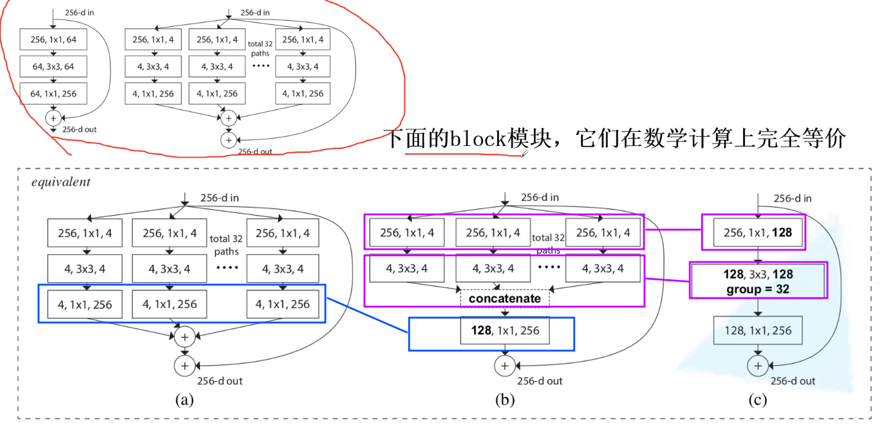

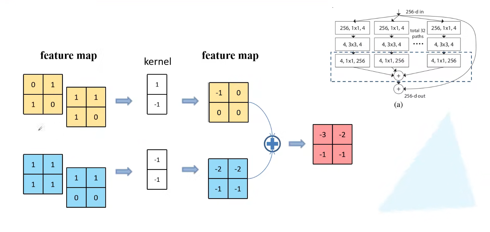

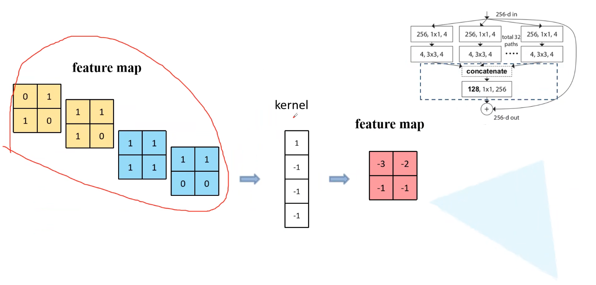

上面两个图，一个不通过group，一个group为2，但是他们得到的的feature map是一样的

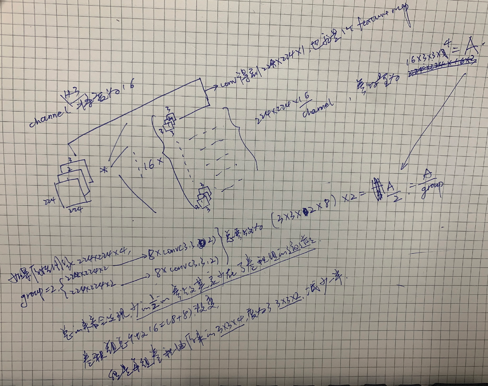

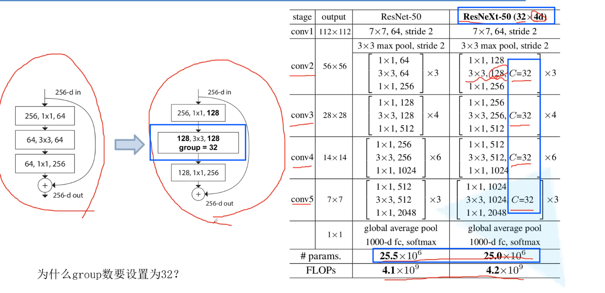

- 32*4d表示的是每个group中的channel数，C=32表示group数，越往后的stage发现C并没有变化，所以此时每个group的数量就会翻倍

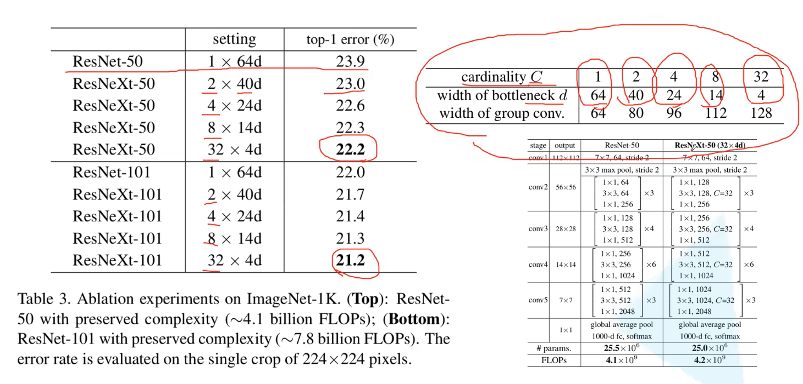

- 作者实验发现32*4d的效果最好

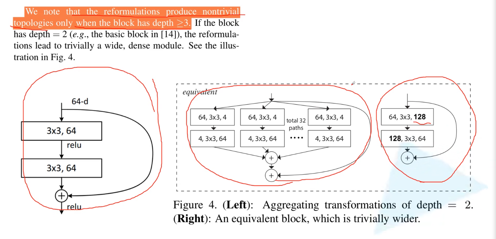

当Block中的层数<3时虽然左右两种的计算上是等价的，但是作用不大