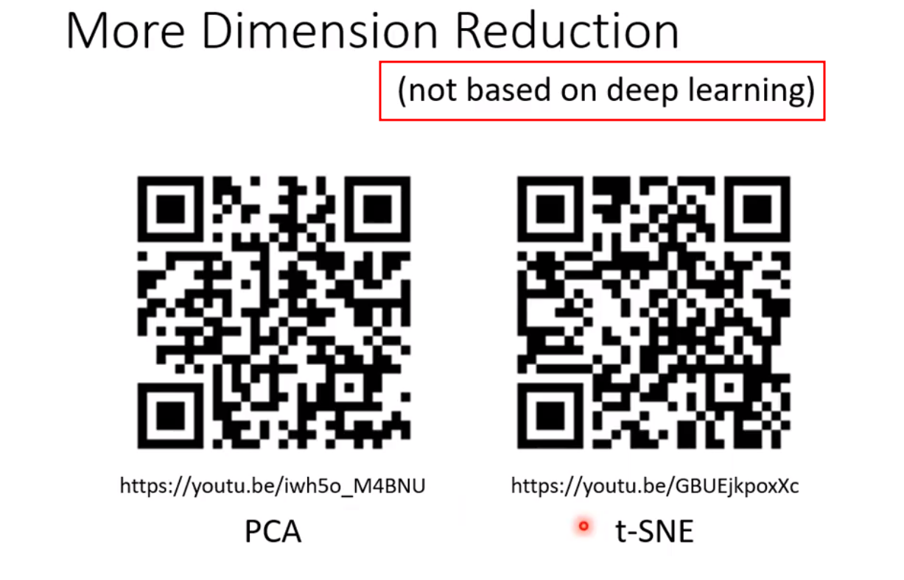
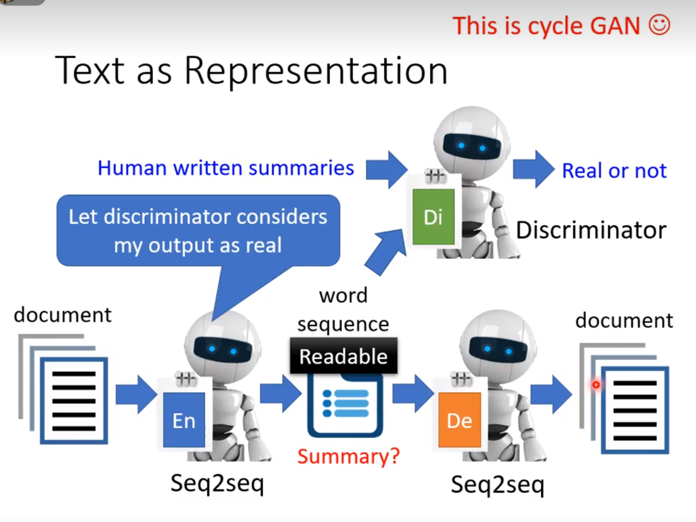

- 也叫做re-constractor

- 中间Vector有时候也叫做bottleneck

## Why Auto-encoder?

- 某些图片变换的范围还是有限的

## De-noising Auto-encoder

- 最终要得到的不仅是Vector通过Decoder的结果，还要De-noising

- BERT其实就是一个De-noising的一个Auto-encoder

## 应用1-Feature Disentanglement

disentanglement 解纠缠

syntax 语法
semantic 语义的

- 经过Encoder的这些向量哪些维度分别所代表的内容是什么，我们不知道，所以要disentanglement

- 经过disentanglement之后，就可以将二者代表语义的和代表声音特征的进行交换，就可以进行变音

## 应用2-Discrete Latent Representation-离散潜变量

discrete 离散的

representation不仅可以是scale也可以是binary，甚至有可能是一个one-hot

Discrete representation中最知名的就是VQVAE

### VQVAE

Encoder、Decoder以及Codebook都是从数据中学出来的，这样做的好处是可以有 Discrete Latent Representation。也就是 Decoder 的输入一定是 Codebook中向量的其中一个。假设 Codebook 中有 32 个向量， Decoder 的输入就只有 32 种可能，就是这个 Embedding是离散的，没有无穷无尽的可能，它只有 32 种可能。

举例来说，**如果一段声音讯号输进来，经过这样的训练后，可能可以发现这个 Codebook 可以学到最基本的发音部位**。

 