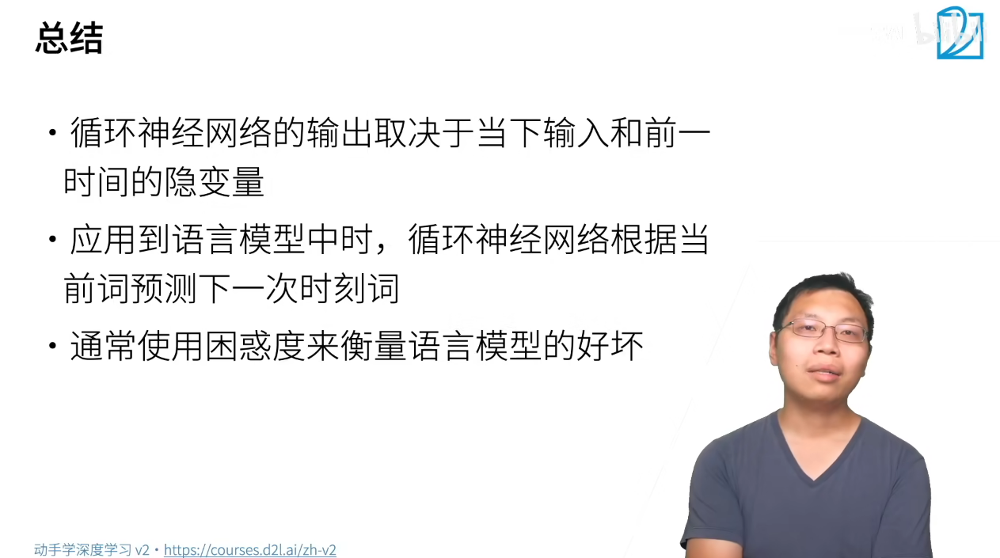

# 38_RNN

$O_t$输出就是要去match$X_t$的输入但是又不能看到$X_t$,就是当前时刻的输出就是预测当前时刻的观察，但是输出又发生在观察之前，也就是说$O_t$是根据$H_t$来输出的，但是$H_t$用的是$X_{t-1}$的东西,然后计算损失的时候计算的是$X_t$和$O_t$之间的关系，

整个过程并没有对X建模,所有的X之间的sequence信息，都存在H里面

## 衡量模型的好坏

每一次预测的词都可以作为一个分类问题

## 梯度裁剪

防止梯度爆炸，使得梯度的long一直不会超过$\theta$

## 更多的应用RNNs

 

Tag生成就是对每一个词进行输出，告诉我这个词的词性或者是别的内容

## 总结

**<u>整个RNN结构是共享1组(U,W,b)的</u>**,这也是RNN最重要的特性

# QA

1. 有没有模型即能够处理时序信息，同时还能够做目标检测，比如想追踪一个视频里的目标，应该怎么做？

    视频Tracking是比较成熟的一个领域了，因为目标在下一个时间段不会移动的太快，应该也就在附近的pixel

2. 多模态 Transformer可以同时处理图像和文字