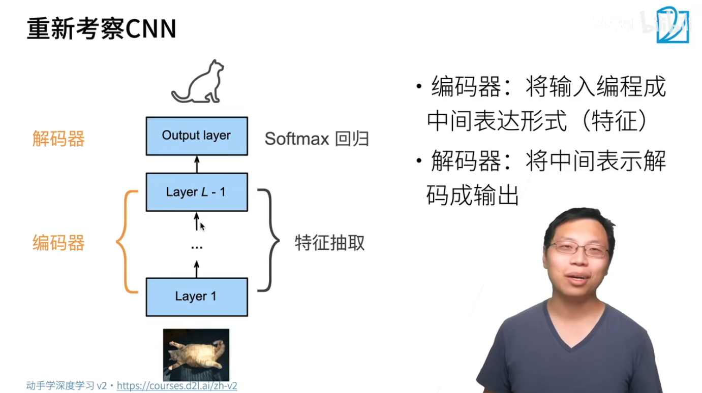
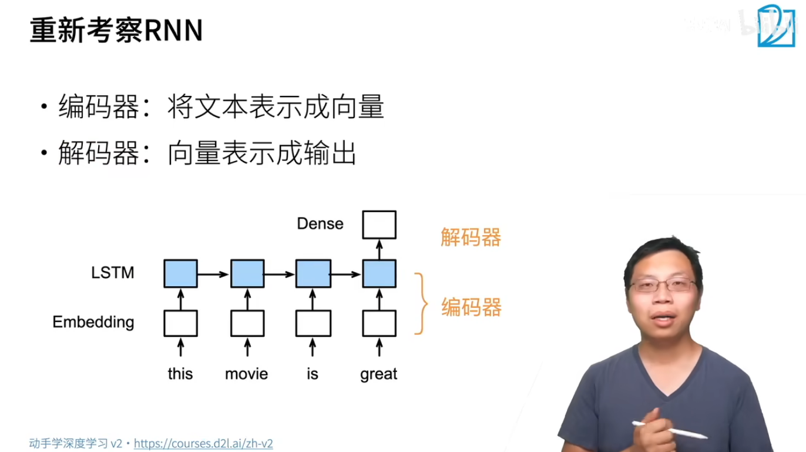
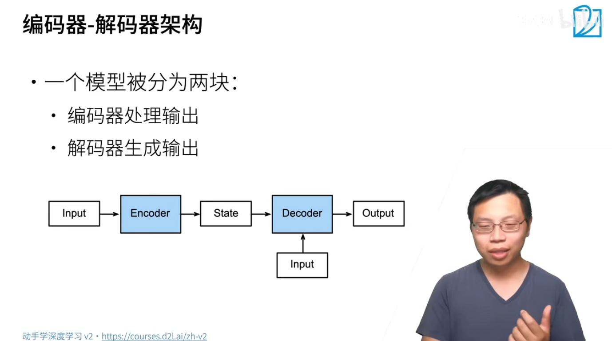

## CNN或RNN都符合encoder-decoder结构





## 编码-解码架构



## CODE

```python
# --coding:utf-8--
from torch import nn


class Encoder(nn.Module):
    """编码器-解码器架构的基本编码器接口"""

    def __init__(self, **kwargs):
        super(Encoder, self).__init__()

    def forward(self, X, *args):
        # ... 进行实现
        raise NotImplementedError


class Decoder(nn.Module):
    """编码器-解码器架构的基本解码器结构"""

    def __init__(self, **kwargs):
        super(Decoder, self).__init__()

    # 主要解决的是编码器的状态怎么样传给解码器
    # enc_outputs就是encoder所有的输出，
    # 比如网络是RNN的话，那么这个enc_outputs就是输出和状态两种值
    def init_state(self, enc_outputs, *args):
        raise NotImplementedError

    # X可以理解为Decoder自己的输入，然后state就是Decoder根据拿到的enc_outputs不断要维护的值
    def forward(self, X, state):
        raise NotImplementedError


# 合并encoder和decoder
class EncoderDecoder(nn.Module):
    """编码器-解码器架构的基类"""
    def __init__(self, encoder, decoder, **kwargs):
        super(EncoderDecoder, self).__init__()
        self.encoder = encoder
        self.decoder = decoder

    def forward(self, enc_X, dec_X, *args):
        enc_outputs = self.encoder(enc_X, *args)
        dec_state = self.decoder.init_state(enc_outputs, *args)
        return self.decoder(dec_X, dec_state)
```