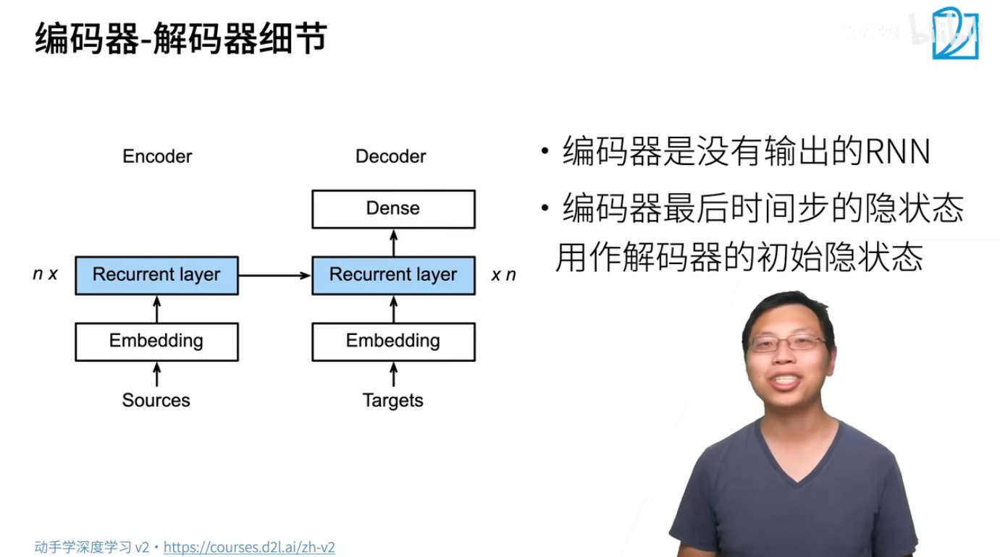
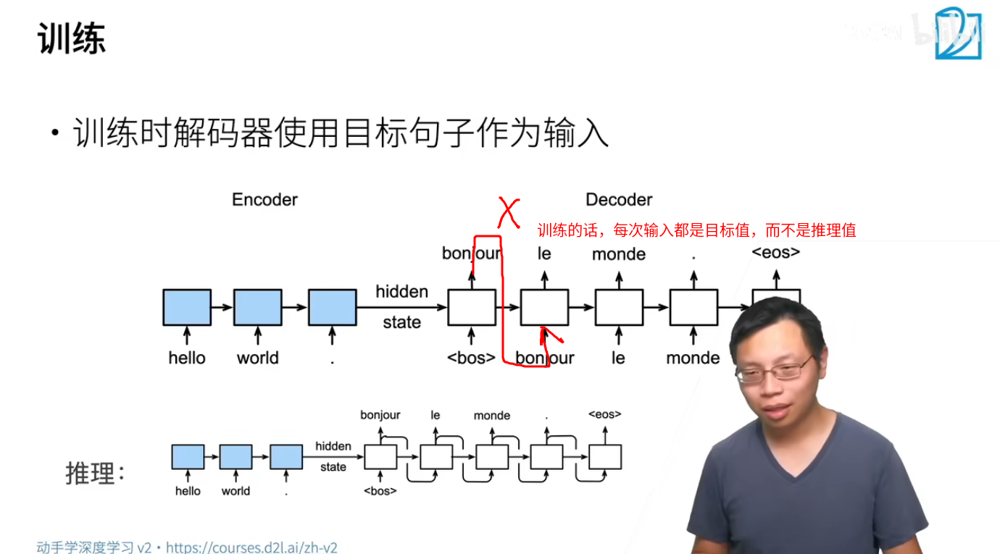
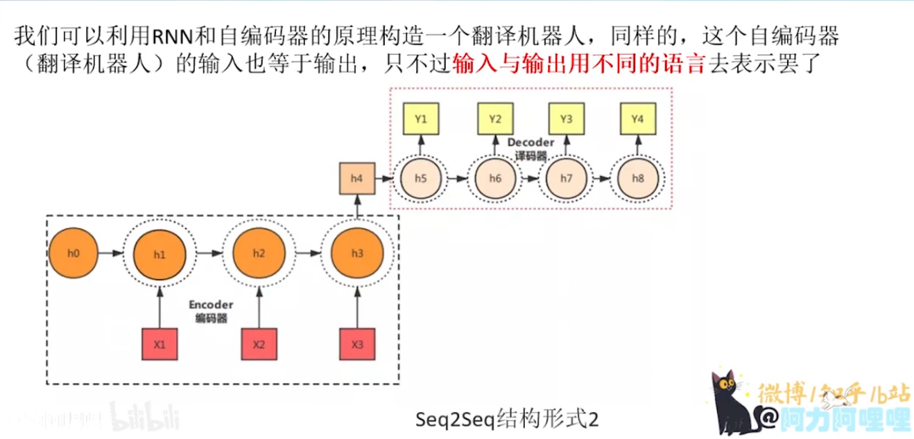
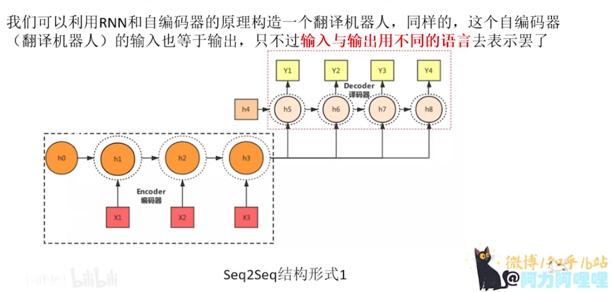
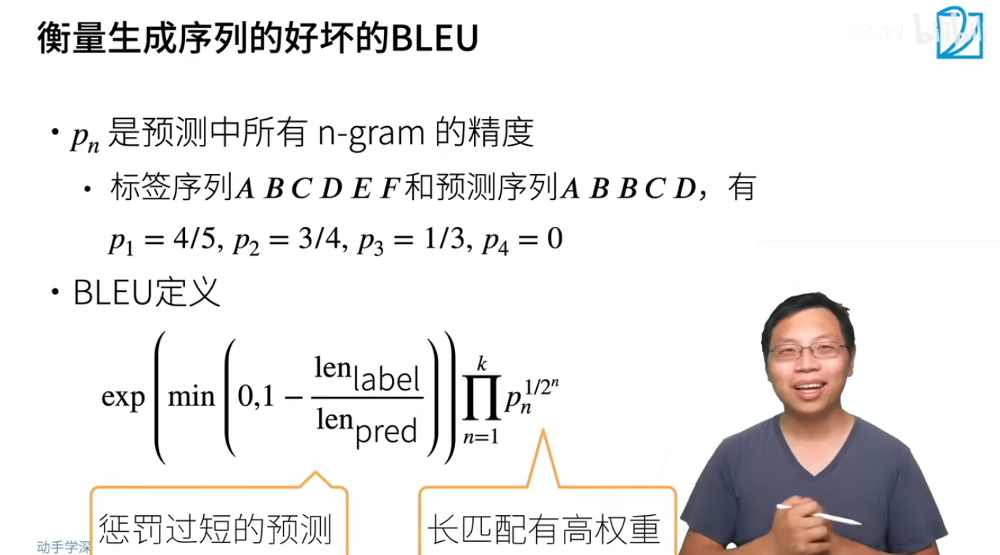

## 实现细节

主要看代码

## 训练

可以看出，训练跟推理不同，推理的下一个输入就是上一个输出，但是训练的话就是每一次的输入都是target值

## BLEU

p的计算方法可以说是贪心的计算方法，比如p1，预测序列的结果为ABBCD，标签序列为ABCDEF，那么进行一一对应，不能重复，发现结果序列在原始序列中总共能够对应4个，这个对应是不看位置前后的，然后结果序列的总长度为5，所以p1=4/5

BLEU的公式：

- 首先，<u>**越大越好，1是最高最好，越小越差**</u>，公式的值由两项相乘得来：

- 第一项：
    - 当len_pred>>len_label,此时预测的比较长，其实是更不容易命中的，取min后结果就是0，再exp的结果就是1
    - 当len_pred<<len_label,此时预测的比较短，更容易命中，那么min就很有可能是负数，再取exp后就是一个小于1的数字
- 第二项，n-gram的精度首先是pn连乘，但是对于每一个pn也有一个惩罚，就是$1/2^n$，可以看出，这个惩罚是按照n的指数级进行的惩罚，因为p一定是一个小数，如果让p固定：
    - 当$1/2^n$越大时(即n越小，句子越短)，$p^{1/2^n}$越小，效果越不好
    - 当$1/2^n$越小时(即n越小，句子越短)，$p^{1/2^n}$越大，效果越好

- 两个部分，第一个部分是对过短预测的惩罚，如果过短，那么第一部分的权重会比较小，第二部分是让长匹配具有高权重，因为长匹配命中的概率相对是更小的。

## 总结

