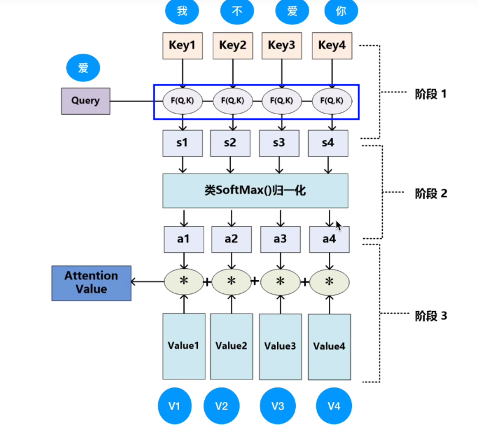
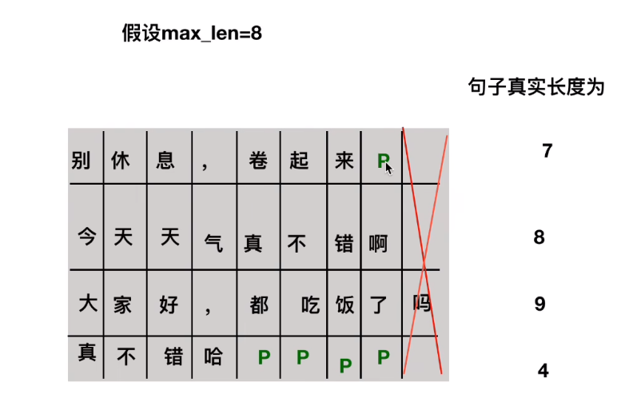

# Transformer

# 整体介绍

以翻译作为例子

典型的Encoders-Decoder结构

- 每个Encoder虽然结构上相同，但是参数上不同，训练的时候并不是说训练了一个Encoder然后copy了其他5个，而是6个Encoder都在训练，因为在后期预训练模型有一个airbert，就是通过共享transformer中某些层的参数达到减少bert参数量的目的，Decoders也是同样道理。

- 左右两部分可以看出Encoder和Decoders的不同大概有两个地方，一个是多了一个交互的block，另外一个是Decoders使用的是Masked的多头注意力机制

## Encoder

### 输入部分

1. Embedding

2. 位置编码

    

    RNN中使用的都是一套参数，U，V，W，

    - RNN的梯度消失有什么不同？有的人会说是因为连乘效应会导致梯度消失，其实这是不准确的，因为RNN的梯度是一个总的梯度和，它的梯度消失并不是变为0，而是总梯度被近距离梯度主导，而远距离梯度忽略不计，所以RNN这种结构非常适合处理天然的时序关系，
    - 但是对于transformer来讲，在处理句子的时候是并行化的，这样做增快了速度，但是忽略了单词之间的序列或顺序关系，这个时候就需要位置编码

    

    - pos-position，2i代表的是偶数位置，2i+1代表的是技术位置

     

    

    - 正弦余弦函数对于同一个位置(pos)的不同向量使用不同的sin或cos体现出的是一种绝对位置信息，与此同时，从公式(2)可以推导出(3) 

## 注意力机制本质

- Query首先先和每个key做点积，得到的是(Query在Key上的投影距离)，其实也就是二者的相似度，经过softmax相当于进行一次归一化，然后在乘以V相当于是**<u>对V求加权和</u>**，也就是说Value的值会更偏向于权值更大的那一个Query

- F(Q，K)就是计算相似度，有三种方式，cos，点乘，mlp，

### Q，K，V怎么获取

- 注意，不同的Input在计算不同的q时，使用的是相同的$W$  

- 实际情况下是实行的并行机制。除以根号$d_k$是为了保证方差为1

### 多头注意力机制

使用一套$W^{qkv}$进行计算是单头，那么使用多套$W^{qkv}$进行计算就是多头，可以理解为通过多组W把相同的Input映射到了不同的空间或者位置，保证transformer可以注意到不同的子空间的信息，捕捉到更加多的特征信息

## 残差和LayNorm

- 最后一个公式的连乘其实也是通常情况下梯度消失的原因，但是这里会发现还有一个1，所以梯度不会消失

## Decoder

### Masked Multi-Head Attention

在预测YOU时，我们是没有后面的YOU和NOW的，模型看不到未来时刻的单词，这一点与训练时是不同的，训练时是无论当前预测到的是什么，下一次的输入还都是gt，所以就需要在预测当前词的时候，将后面的词都masked掉

## 交互层

- KV来自于Encoder，Q来自于Decoder

- Encoder的输出会和Decoder的每一层都做交互

# Code

      

