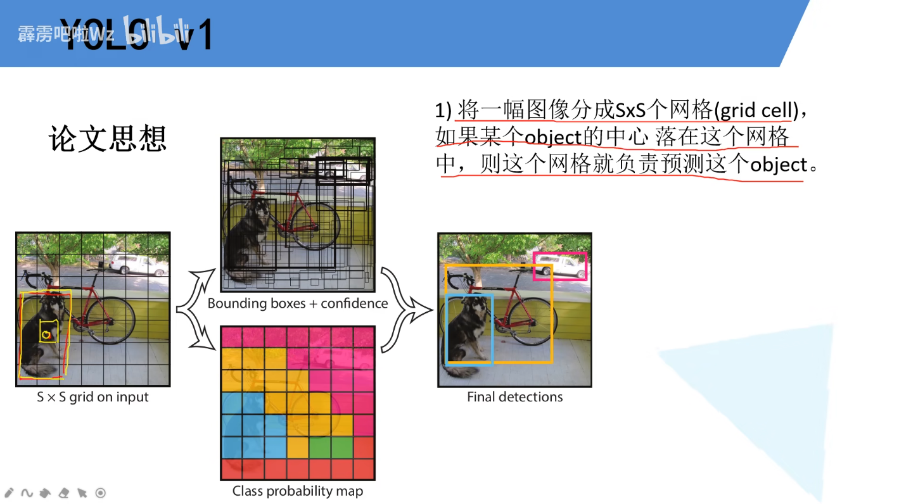
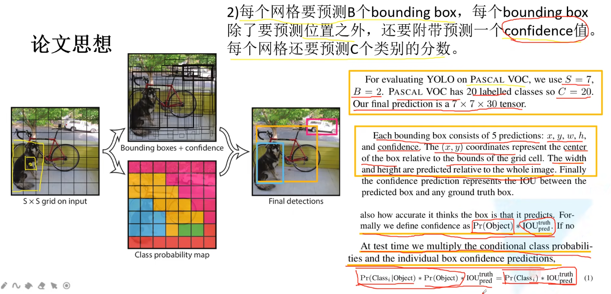
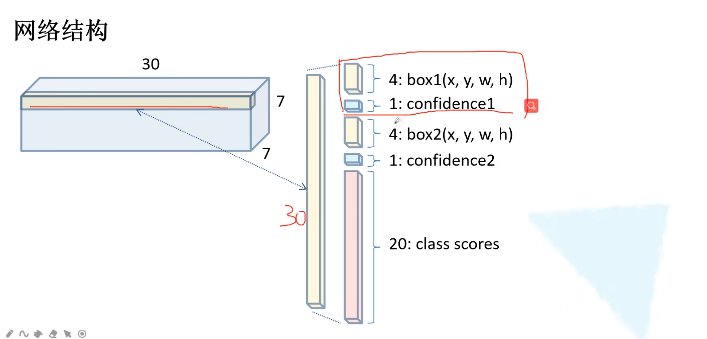
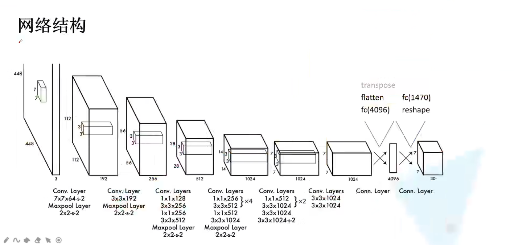
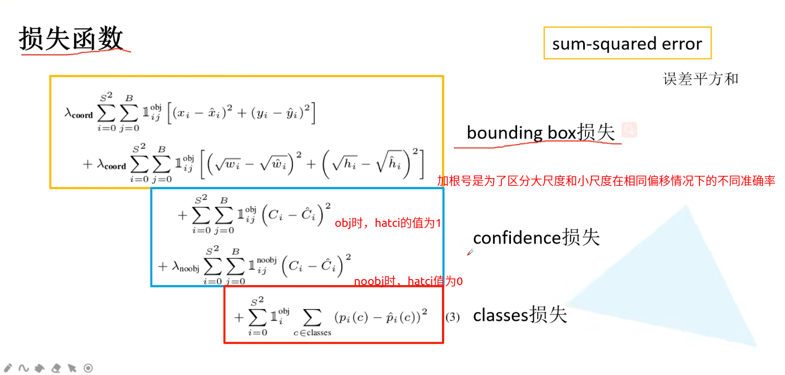
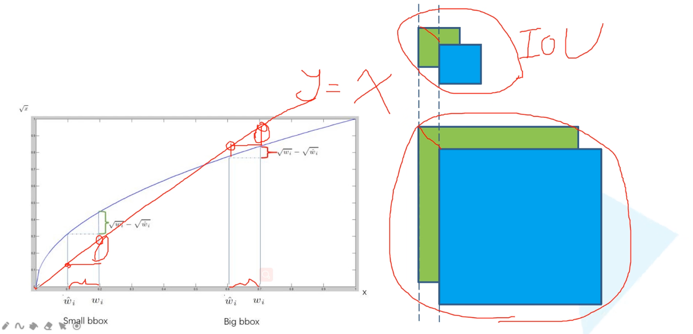
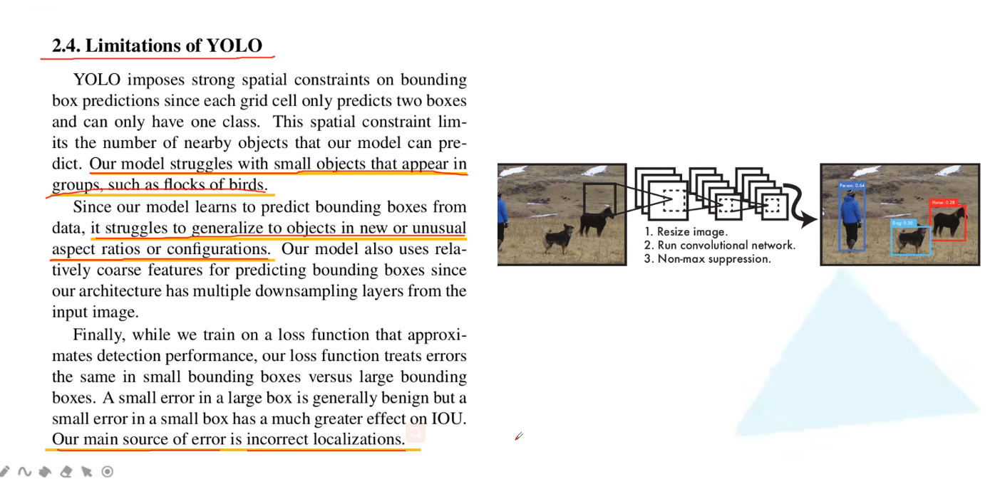

## 论文思想

例如这个狗，那么这个狗最中心的grid cell就负责对该目标的识别

S一般取7

- B -> bouding box的意思就是每张图最多有2个物体
- (x,y)是一个相对值，是相对当前的grid cell而言的，所以介于0-1
- w,h也是相对值，是相对整个图像而言的，同样介于0-1
- Pr(Object)就是指如果grid cell中有物体则是1，否则是0
- 这里的IOU是我们预测的bb和gtbb的交并比，YOLO中是没有anchor的,所以这里的xywh是预测我们的bb位置的，并不像fastrcnn和SSD中一样
- (1)式最终给出的概率分数既包含了它为某个目标的概率，也包含了预测边界框与真实边界框的重合程度

## 网络结构

 

## 损失函数

## 存在问题

- 对于小的密集的目标检测效果非常差，比如一群鸟，每个cell只预测两个bb，而且这2个bb都是属于同一个类别的，而且我们对于每一个grid cell都只预测一组classes参数	
- 当目标出现了新的尺寸的时候，效果也很差，是因为作者采用的是直接预测的坐标信息，YOLO2中将会改进