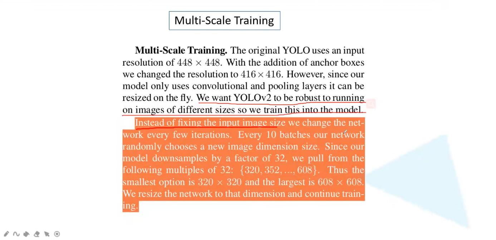

叫做YOLO9000是因为能够达到分类数9000

## YOLOV2相对于YOLOV1的尝试

原始的anchor或者default box的尺寸都是根据经验得到的，这里选择去进行kmeans聚类得到一个大小，又叫做priors

作者提出如果直接使用anchor去预测的话会非常的不稳定，是因为不稳定主要是来自于xy中心点位置的预测，因为在fastercnn中基于anchor的预测时$target_x=(x-x_a)/w_a$，所以反过来得到的$x_{预测值}=t_x*w_a+x_a$并且这个x是没有任何限制的，这种情况放到YOLO中导致的结果就是每一个grid cell的预测值可能出现在图像中的任意一个地方(如下图)，

所以作者就采用了另外一种计算方法就是将$t_x$通过一个$\sigma$sigmoid函数来讲输入映射到0-1之间，这个0-1就是相对于当前的gridcell而言的，以此来达到每个anchor（prior）去负责预测目标中心落在某个grid cell区域内的目标

$t_o$就是confidence，同样需要通过sigmoid函数进行限制

Fine-Grained Features更底层的嘻嘻，更细粒的信息

modifed之后的YOLO通过一个pass through layer将更底层的26*26的特征和13\*13的特征进行融合

## BackBone:Darknet-19

top-1是就看一个，第一个概率最高的预测正确了就算对了，top-5是前5个里面有正确的就算正确了

注意每一个convolutional是三部分组成，而且Conv2d中是不包含bias的，因为后面有BN，最后最后在架构的末尾，Conv2d 125*1\*1就是一个普通的卷积当做分类器来使用，而且在YOLOv2的backbone中删去了darknet最后的一个conv，相当于是darknet18，125的计算方式为（20+5）\*5,20个类别加上xywht,然后5个bb