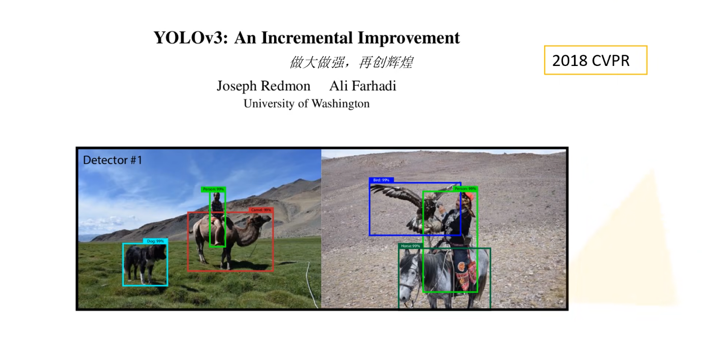

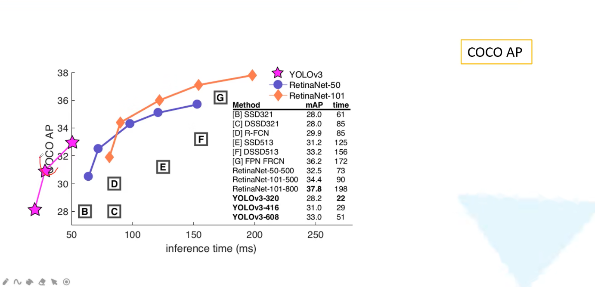

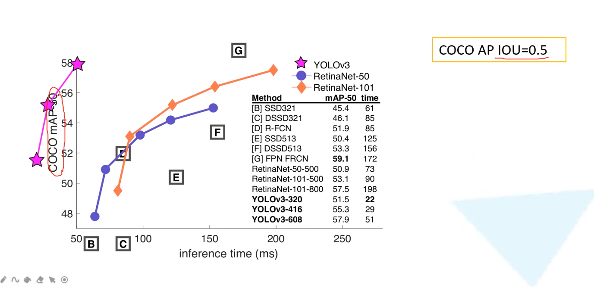

## BackBone

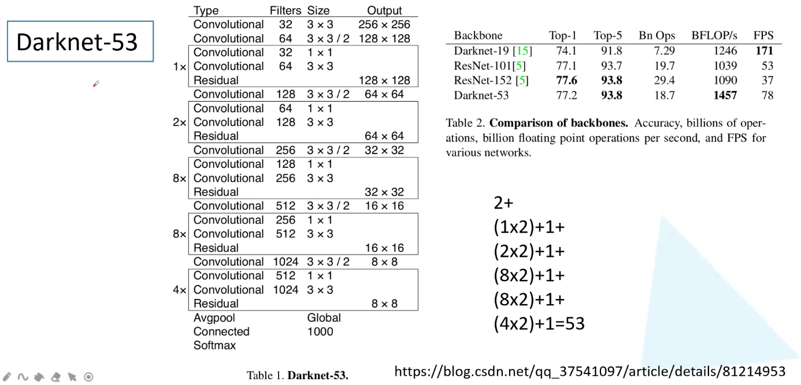

- 为什么darknet的效果要比resnet的效果好？

    darknet53中是没有maxpooling的，而是通过卷积的stride进行尺度的压缩的，而且相比于ResNet-101/152来说，darknet53的参数要少很多，所以要快一些

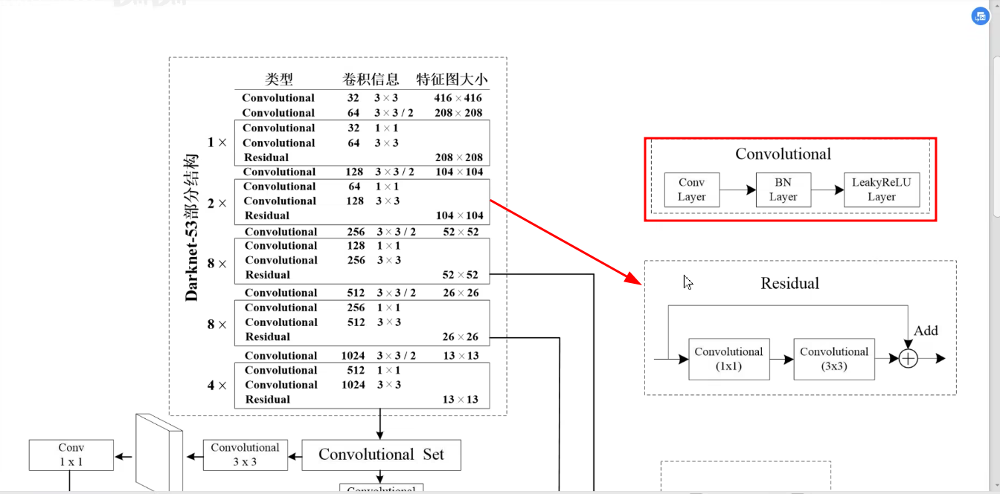

- 每一个Convolutional都是由三个部分组成
- 每一个方框都是一个残差结构而不是每个方框后又跟一个残差结构 

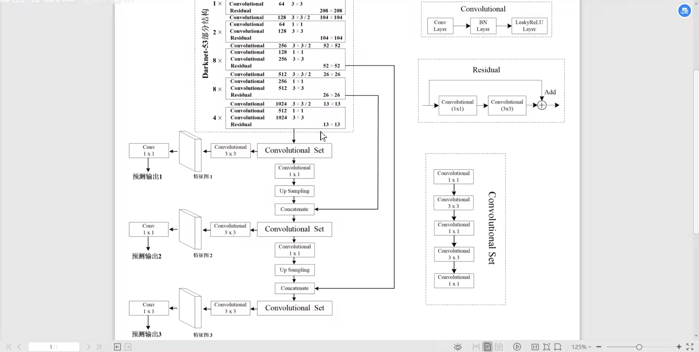

这里的concatenate不是直接相加，而是进行拼接

## 目标边界框的预测

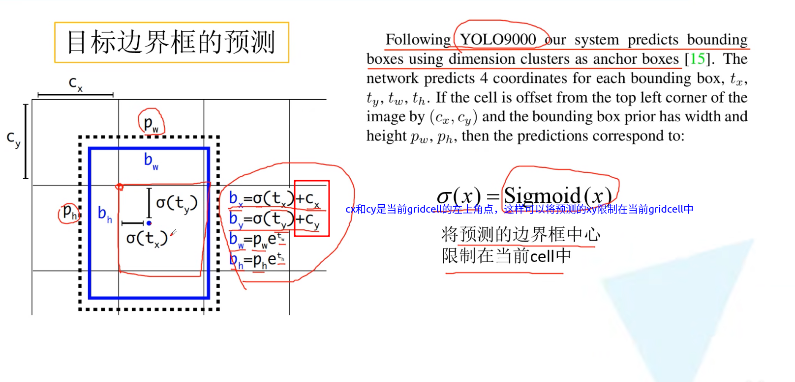

## 正负样本匹配

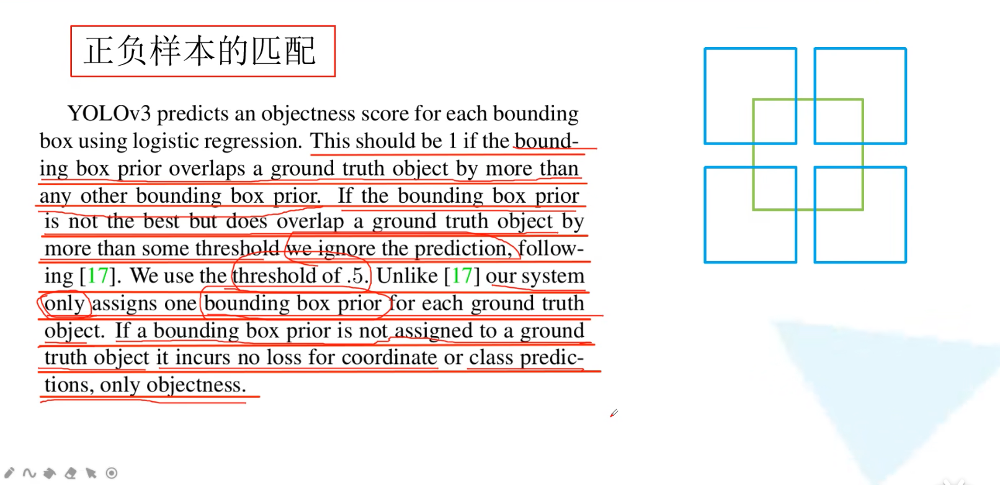

如果bb不是最好的并且超过了某一个阈值，则直接丢弃掉，那么这个样本既不是正样本，也不是付样本，那么此时它不会有类别损失也不会有定位损失，只有一个objectness就是confidence score

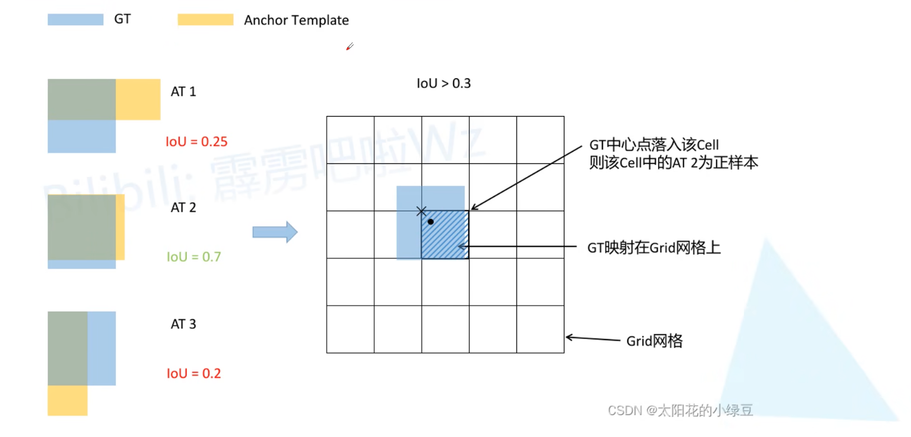

## 损失函数

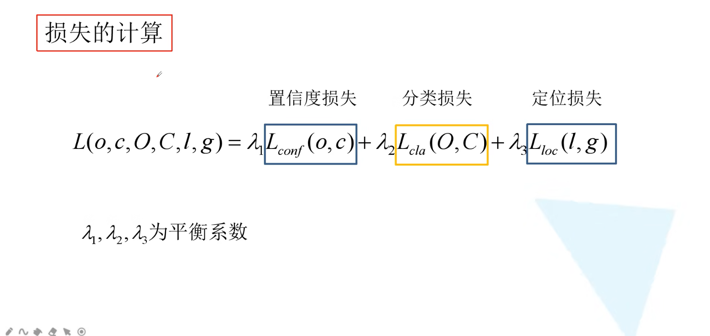

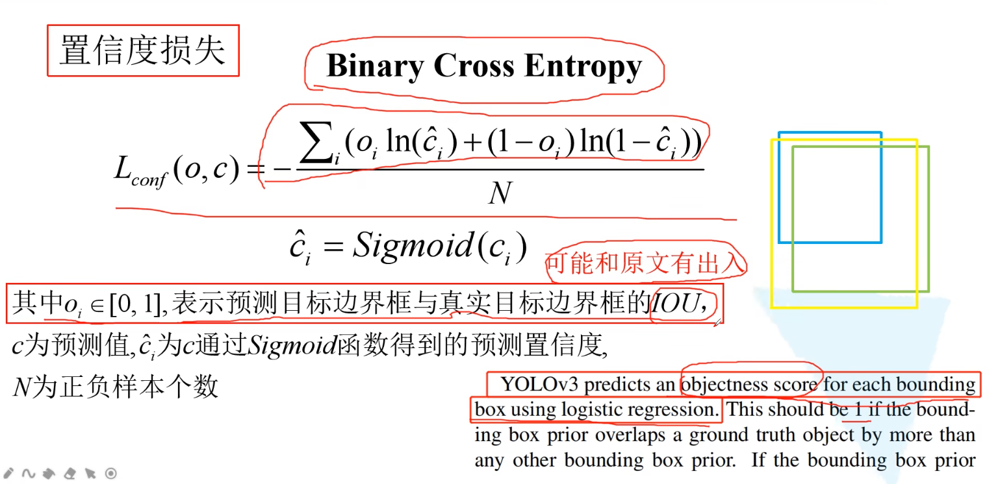             

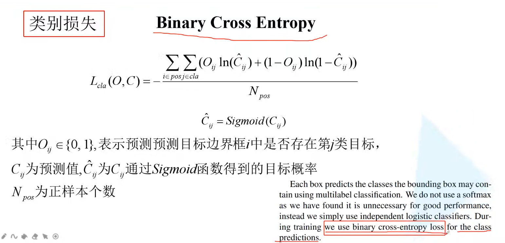

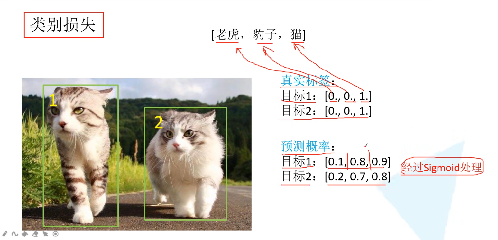

二值交叉熵跟交叉熵损失是不一样的，其值是互不干扰的

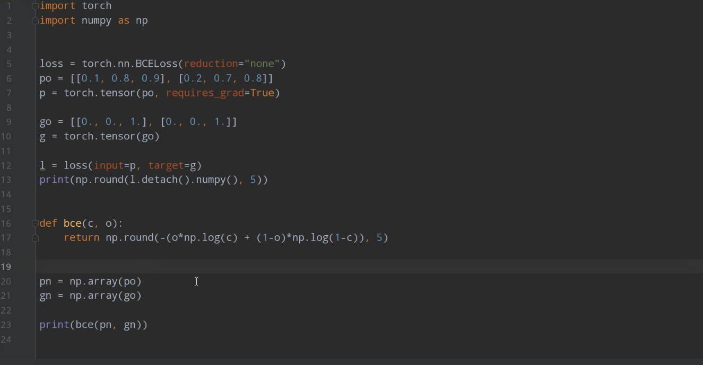  

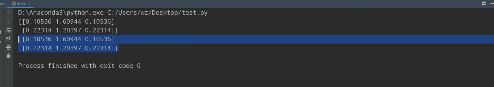

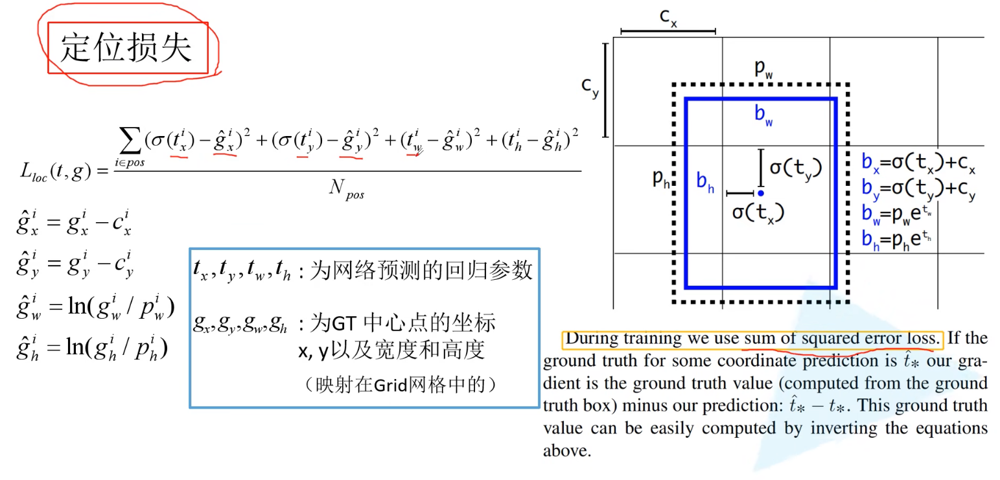