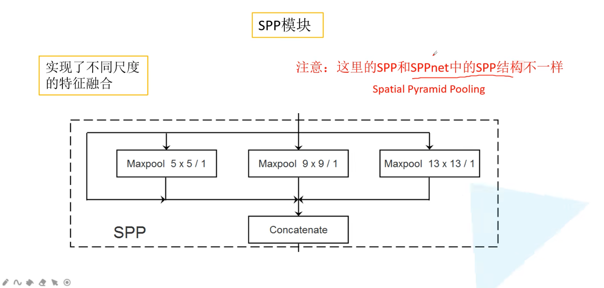

## Mosaic图像增强

默认使用4张图像进行拼接训练

- 在使用Misaic的基础上再加上BN其实是变相增大了batchsize，因为BN就是在求均值方差，如果数据集越大，那么越接近整体数据集的均值方差，效果就会越好，所以这种变相增大batchsize的方式还是有一定效果的

## SPP模块

SPP模块和SPPnet中的SPP结构不一样，只能说是借鉴

- 三个maxpool的stride都是1，然后根据padding可以保证whc都是不变的，从而实现了不同尺度的特征的融合 

- 当然，为什么要在第一个预测特征层前上SPP，而不是在每一个预测特征层前都加上或者说在最后一个预测特征层前加上？

    

## CIoU Loss

### IoU Loss

- 通过上图可以发现的是即使在l2 Loss的值一致的情况下，IOU也是可能不一致的，这也说明了l2 loss不能很好的反应两个目标边界框重合的程度，所以引入了IoU Loss = $-lnIoU$,还有一个比较常见的IoULoss的计算公式就是1-IoU，IoUloss相对于l2loss的好处就是1.能够更好的反应重合程度，2.具有尺度不变性，就是无论重叠的两个矩形框是大还是小，它的重合程度与矩形框的尺度是无关的
- 缺点是当bb与gt的IoU为0时，loss为inf，无法训练，因此IoULoss在回归任务中表现不好

### GIoU Loss

- 绿色是gt，红色是bb，蓝色是$A^c$，u是并集，当bb和gt完全重合的时候，ac就等于u，IoU等于1，此时GIoU=1，当bb和gt完全无关的时候，GIoU=IoU-1+u/ac,此时iou=0,u/ac=0,此时GIoU=-1，所以$L_{GIoU}=1-GIoU(0<=L_{GIoU}<=2)$ 

- GIoU在bb和gt在同一水平或者高度的时候，就退化为IoU

### DIoU Loss-Distance IoU

Liou和LGiou都有的问题是收敛慢，并且回归的不够准确

- $\rho$代表的是欧氏距离，
- b是预测边界框的中心坐标，b^gt是真实框的中心坐标，
- c是两个框的最小外接矩形的对角线的长度
- 两个框重合的时候，d是等于0的，那么DIoU=IoU-0
- 当两个框相距无穷远的时候，d^2/c^2->1，所以此时DIoU=IoU-1=0-1 -> -1
- DIoU损失能够直接最小化两个boxes之间的距离，因此收敛速度更快

### CIoU Loss-Complete IoU

- AP75就是IOU的阈值为0.75
- $L_{CIoU}(D)$是将公式中的IOU替换为DIOU

## Focal Loss

