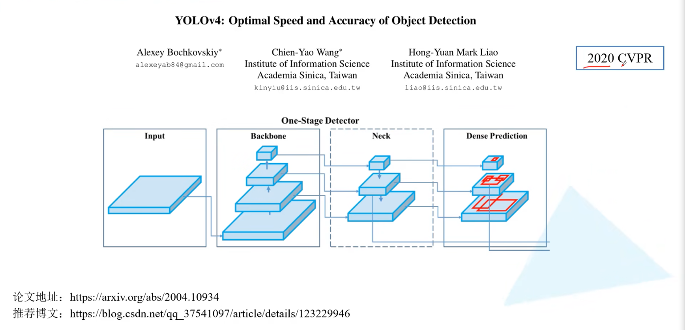

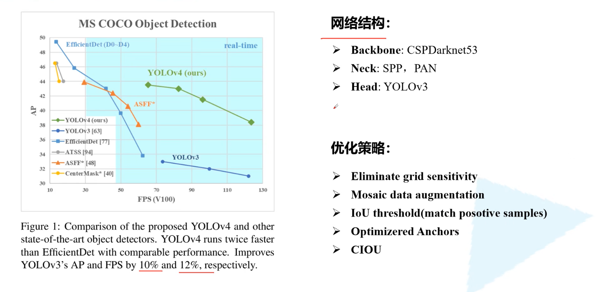

## BackBone-CSPDarknet53

### CSPNet

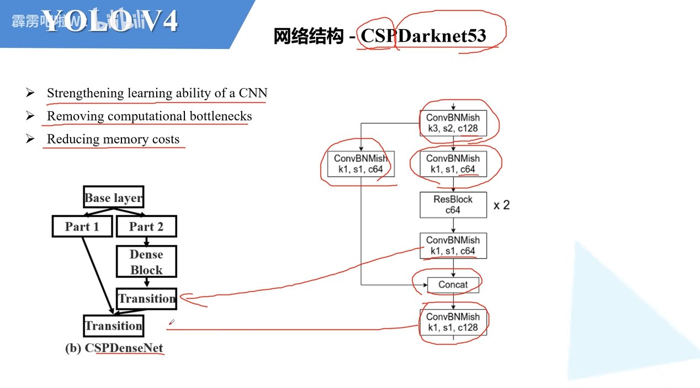

### CSPDarkNet-53

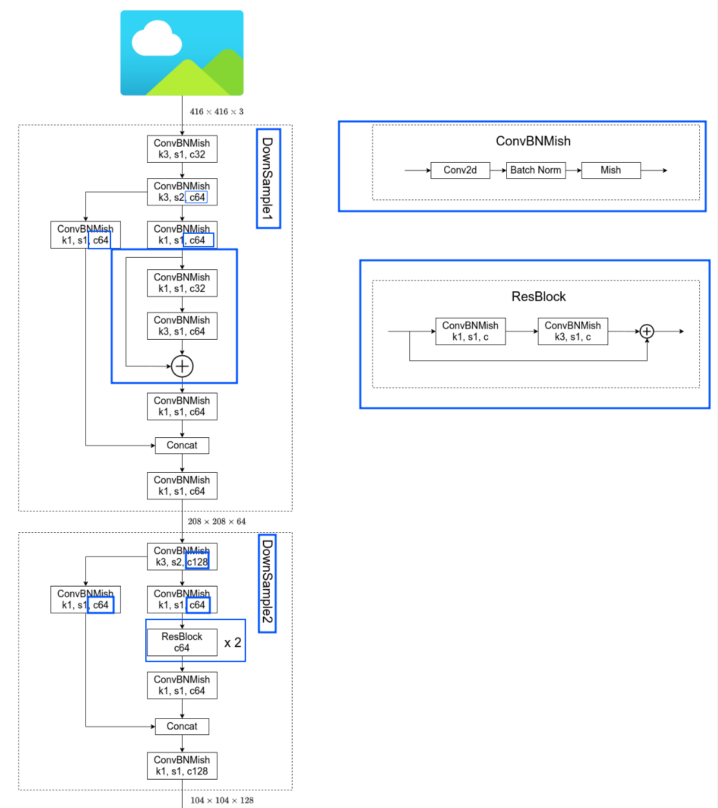

### SPP

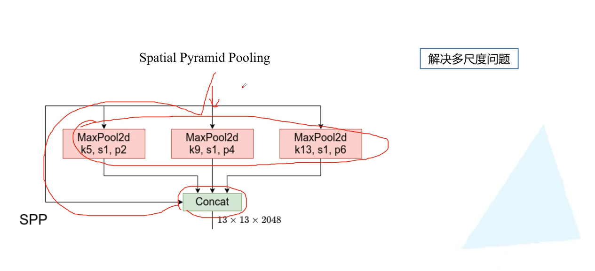

### PAN

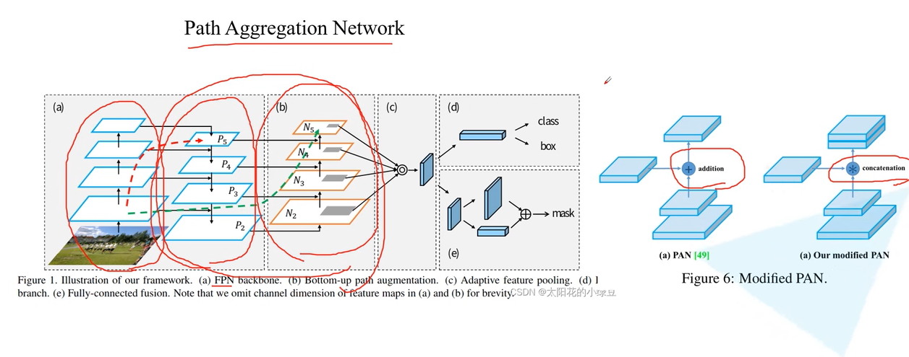 

## 整体架构

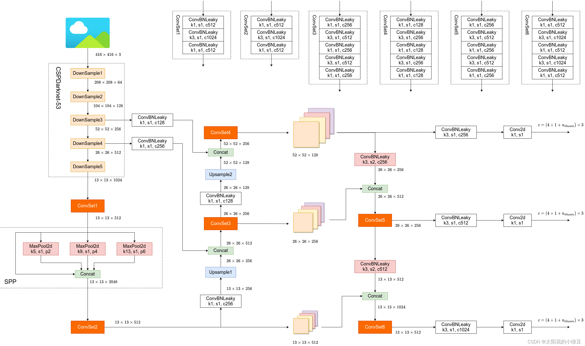

## 优化策略

### Eliminate grid sensitivity

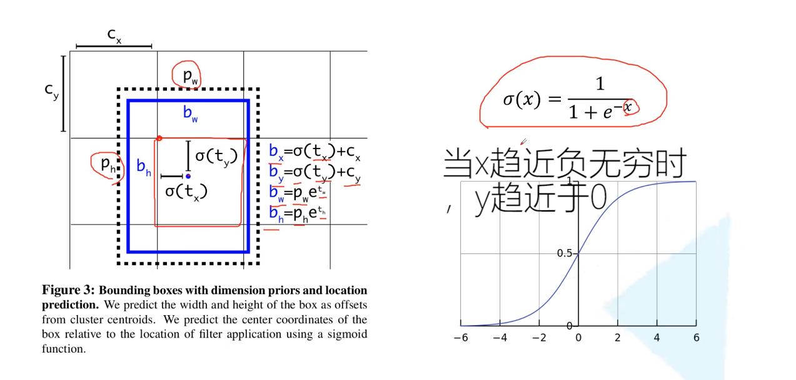

- 主要优化的是当我们的真实边界框就落到了grid cell的边界上时，我们当然希望sigmoid函数是取到0的，但是sigmoid当x趋近于负无穷是才取到0的，所以不合理，所以就优化引入一个缩放因子scale

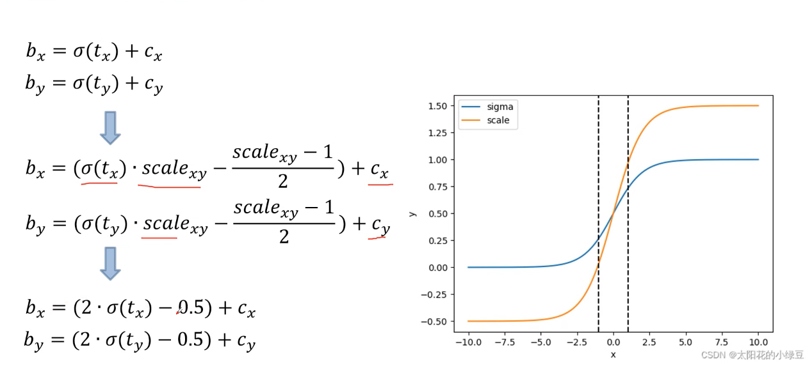

- 比较主流的方法和YOLOv5的scale都是设置scale为2，此时可以看到，bx公式的前一部分的值域从(-1,1)变为了(-0.5,1.5)，全都是开区间

### Mosaic data augmentation

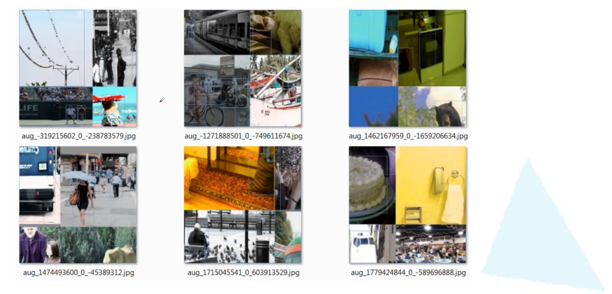

### IoU threshold(match positive samples)

#### v3中：

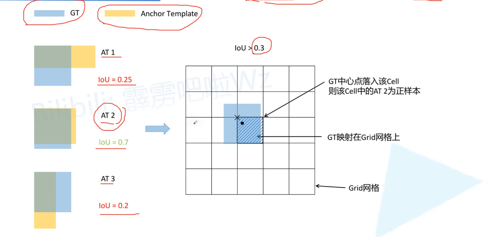

- 针对每一个GT都会和每一个Anchor Template进行一个match，YOLOv3中针对每一个预设特征层都会采用三种不同的模板，AT1，AT2，AT3，匹配的方式为将每一个AT的左上角点和gt的左上角点重合，然后计算IoU，假如超过设置的阈值0.3的话，如上例子，将会采用AT2作为正样本，然后首先将GT缩放到预设特征层上，黑色的点对应的就是当前的gt的中心点，当中心点落入到某一个grid cell的时候，则该cell中的AT2就设置为正样本，那就会出现一个问题就是如果该gt和多个AT都大于threshold怎么办，那么就将当前grid cell对应的超过threshod的多个AT都设置为正样本，正好可以扩充正样本的个数，在原始的YOLOv3中作者说的是只会将gt分配给一个anchor，那么这样就会导致正样本的数量就会非常少

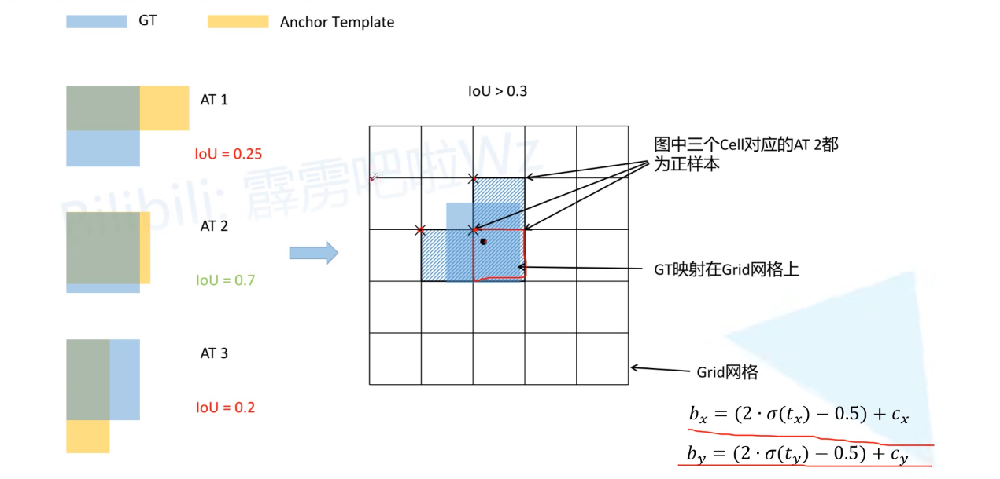

- 在YOLOv4中，前几部和YOLOv3差不多，同样也是计算IoU，然后对比threshold，键对应的gt映射到对应的grid中，那么当前grid对应的超过threshold的AT2就是正样本，但是通过图会发现，除了当前的grid cell之外，还有另外两个gridcell，正上方和正左方，也就是说，这总共3个grid cell对应的AT2都设置为正样本，为什么这样做呢？因为消除grid cell敏感度的操作中，我们重新设置了2个计算bx和by的公式，这使得我们中心点的坐标$center_{xy}$ 的范围从原来的(0,1)给变为了新的范围(-0.5, 1.5),那么此时，我们在去观察正上方的grid cell会发现(这里成为gcA)，相对于gcA,当前的$center_{xy}$的x坐标是在(-0.5, 1.5)之间的，同样，对于gcA，当前的$center_{xy}$的y坐标是在(-0.5, 1.5),同样，对于挡墙gridcell的正左方的gcB,当前的centerxy也都是符合范围要求的，所以将这三个gc的AT2都设置为正样本，所以这又扩充了一波正样本的数量，YOLOv4/5基本都是采用类似的思想。

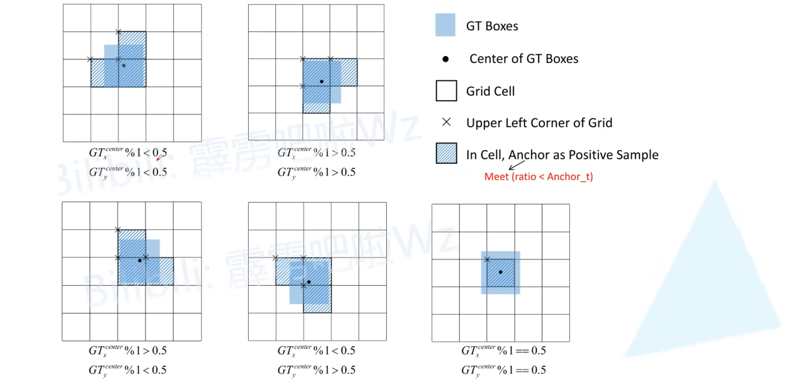

### Optimizered Anchors

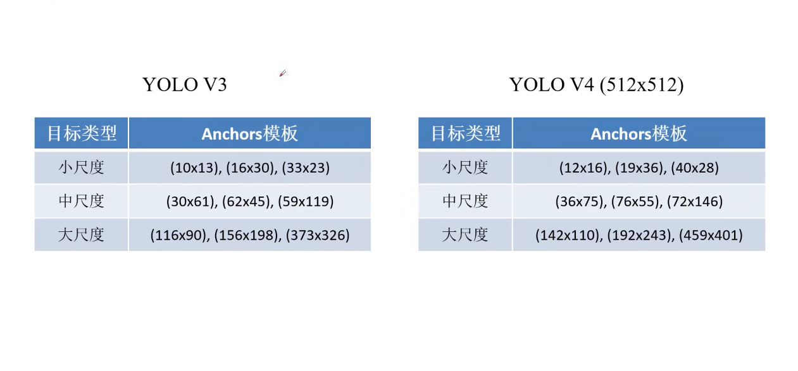

- v5的源码中同样采用的仍然是v3的大小

### CIoU

YOLOv4中作者采用的就是CIoU

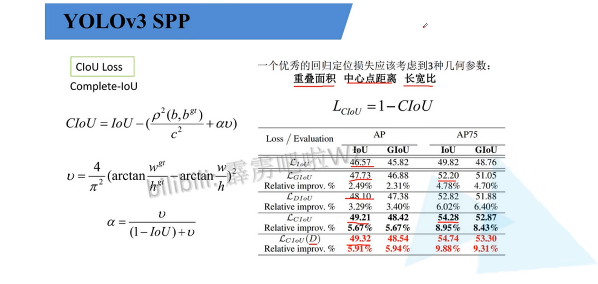